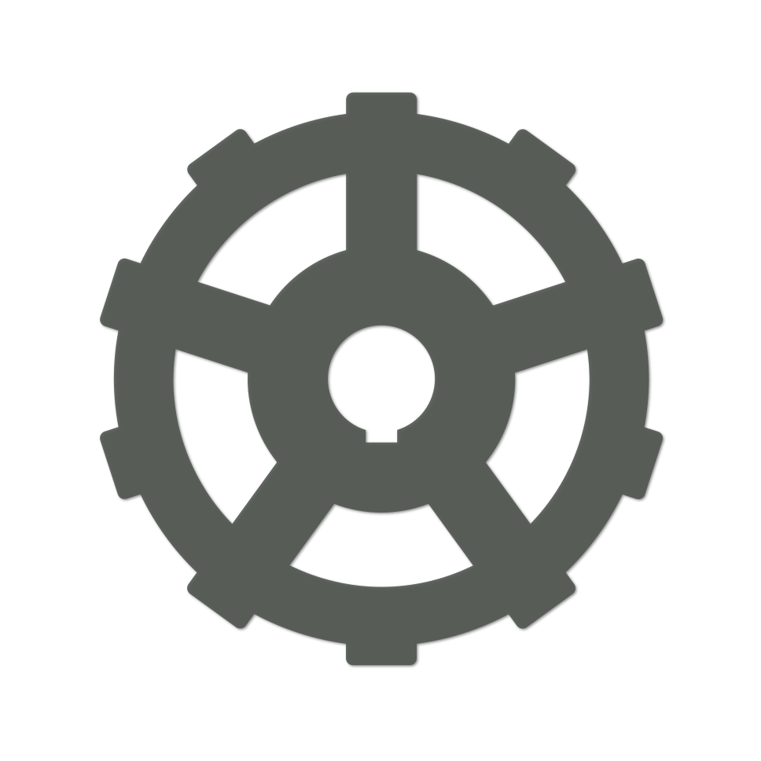

# N\*

    

## Description

N* is a typed assembly language (TAL for short) used as a compilation target for the [nihil programming language](https://github.com/nihil-lang). It features automatic memory management, an easy to understand type system as well as zero-cost abstractions like structures and unions.

## Examples

Some code examples can be found in the [examples](./examples) directory.
